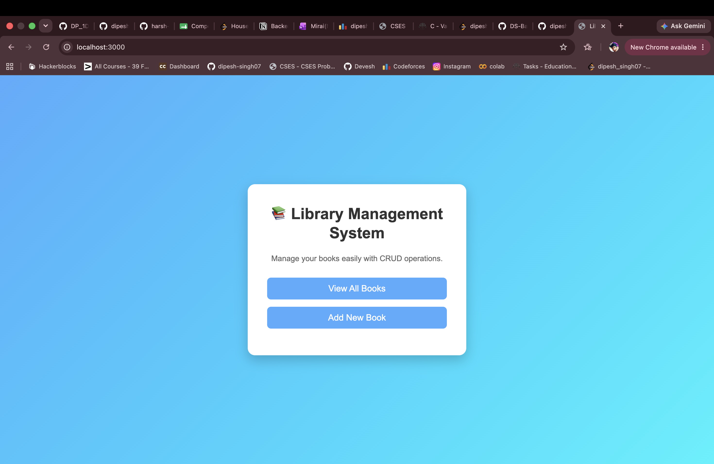
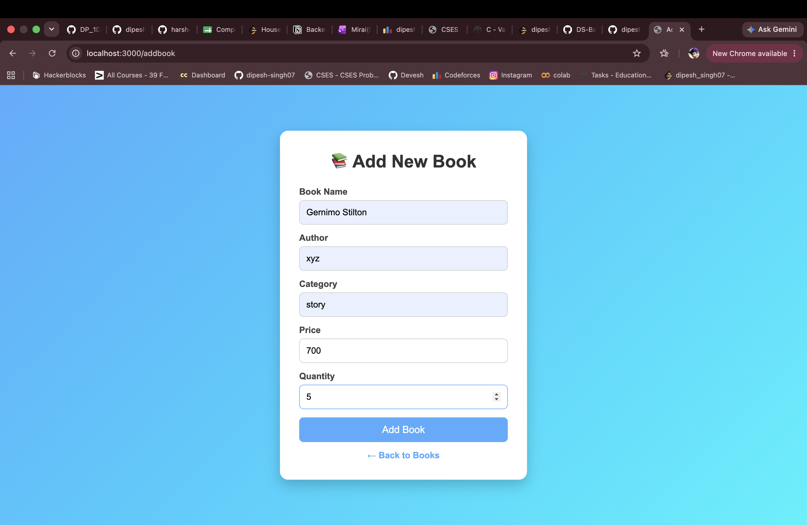
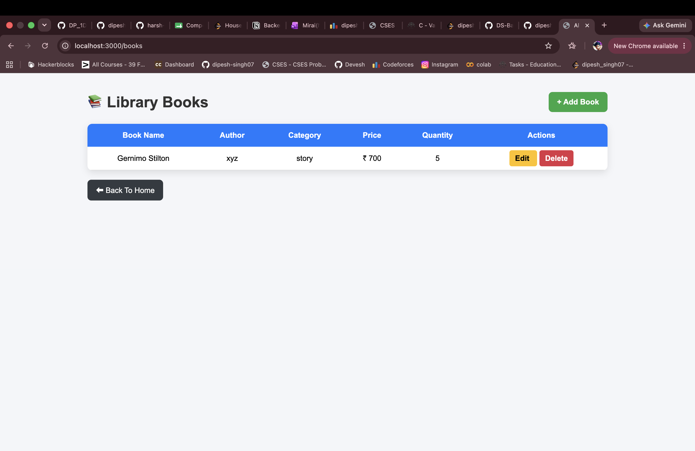

# 📚 Library Management System

A Library Management System built using Node.js, Express.js, EJS and MongoDB that allows users to perform complete CRUD operations on books.

## 🚀 Features

- Add New Books
- View All Books
- Update Book Details
- Delete Books
- Clean and Responsive UI
- MongoDB Database Integration

## 🛠️ Tech Stack

- Node.js
- Express.js
- MongoDB
- Mongoose
- EJS
- HTML
- CSS

## 📸 Screenshots

### Home Page



### Add Book Page



### Books Page



## ⚙️ Installation

```bash
git clone https://github.com/dipesh-singh07/Library-Management-System.git

cd Library-Management-System

npm install

node app.js
```

Open:

```text
http://localhost:3000
```

## 👨‍💻 Author

Dipesh Singh

GitHub: https://github.com/dipesh-singh07
